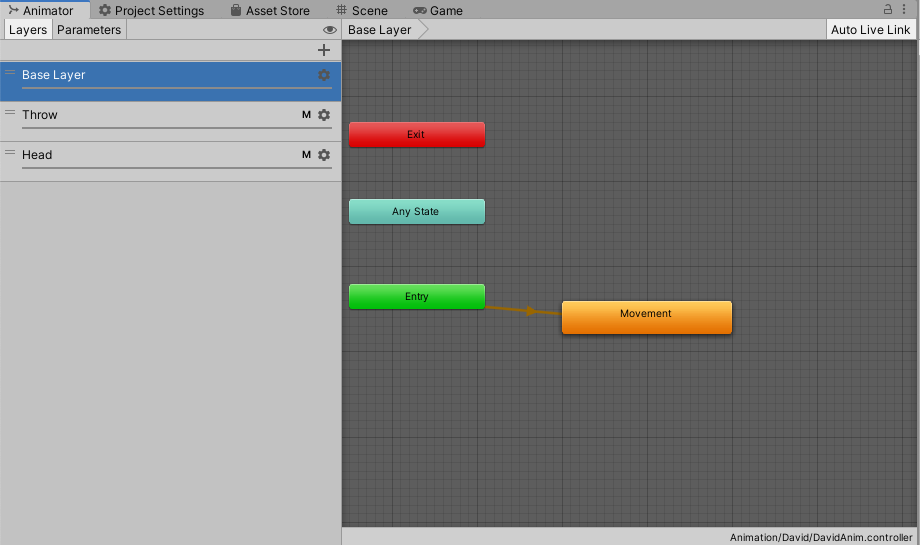

# Game Characters
There is a [base class](https://github.com/jamalcraig/Dunamis/blob/main/Unity%20CE301/Capstone%20Project/Assets/Scripts/GameCharacter.cs) that all characters in the game inherit methods and variables from.

[Player](#player)   
[Racer](#racer)   
[Player Clone](#player-clone)   

## Key Bindings
I created a [singlet class](https://github.com/jamalcraig/Dunamis/blob/main/Unity%20CE301/Capstone%20Project/Assets/Scripts/Bindings.cs) that handles all the player’s button inputs. Every class that requires button inputs must reference the singlet to find out if a button is being pressed. All Game Characters inherit a method that assigns the reference to the singlet. The method has to be called in order for the singlet to be referenced.

I had to make separate button binds for playing on the phone and testing in the Unity Editor. The default setting when the game starts is for the buttons to be bound for playing on iOS, so that I don’t have to keep on manually switching the button bindings to fit it before I build. It was like that in the past, so sometimes I would forget and have to build the whole game again to rectify it for use on iOS. When playing in the Unity Editor, I just have to press the “=” keyboard button at the start of play, and then the buttons will switch for the correct bindings for playing in the Editor. Pressing “-“ switches the binding mode to iOS’, which doesn’t function correctly in the Unity Editor.

I couldn’t find a button binding map for ps4 controllers connected to iOS, so I had to use trial end error work out what was the correct input id for all the buttons on the PS4 controller. In the end, 25 working inputs were mapped. Consisting of 15 buttons and 10 axes. The trigger() method and the findingBut() method are remnants of how I used trial and error to work out which inputs did what.
[Here is the button map I made](https://github.com/jamalcraig/Dunamis/blob/main/Technical%20Documentation/Game%20Characters/ButtonMap.txt)  

## Player   
The [Player Controller Class](https://github.com/jamalcraig/Dunamis/blob/main/Unity%20CE301/Capstone%20Project/Assets/Scripts/PlayerController.cs) is used to control the movement and functionality of the player.    

### Basic Gameplay Loop   
In order to play the game as intended, the player is supposed to go around collecting Dunamis gems in order to earn points and collect ammunition that can be used to attack enemies with. The player can activate an ability that displays the shortest path to the nearest gem spawner that contains a Dunamis gem. The player must avoid being hit by enemy NPCs who chase and attack the player. If the player is hit by an enemy, they lose health. If the player’s health depletes to zero, the player will die, and the game will end. The player can defend themselves by throwing Dunamis gems at the enemies.   

### Movement   
The player can use the left analogue stick on a PS4 controller to move the player in direction that the stick is pointing.   

### Pathfinding   
The ability for the player to display the shortest path to the gem spawner that contains a Dunamis gem can be activated by pressing L1 on the PS4 Controller. When this ability is activated, the player will see a path of markers that lead to the nearest gem spawner that contains a Dunamis gem. The [player class](https://github.com/jamalcraig/Dunamis/blob/main/Unity%20CE301/Capstone%20Project/Assets/Scripts/PlayerController.cs) does this by telling the [Player Pathfinding Class](https://github.com/jamalcraig/Dunamis/blob/main/Unity%20CE301/Capstone%20Project/Assets/Scripts/TankPathFind.cs) to calculate a path using A* search.    

For every node returned in the A* Search, a marker is placed in the air to display the path. If the player moves so that they are closer to the gem spawner, than a marker, that marker will disappear. If the player moves to a position where the marker is closer than the player to the gem spawner, the marker will reappear. When the player arrives at the gem spawner the path will be cleared so that the markers do not reappear when the player moves away from the gem spawner.    

### Collecting Dunamis Gems   
When the player is in close proximity to a spawned Dunamis gem, they can collect it by pressing R1 on the PS4 controller whilst looking directly at the Dunamis gem. The player will be awarded points upon collecting a Dunamis gem, and the counter for how many Dunamis gems are currently being carried will increase. The amount of Dunamis gems that the player is carrying is the same amount of ammunition they have to throw at enemies.   

### Combat   
In order to protect themselves from the horde of enemies that chase and attack the player, the player can throw Dunamis gems in direction they are looking. They can do this by pressing R1 on the PS4 controller. Every Dunamis gem thrown reduces the amount the player is carrying, so if the player runs out of Dunamis gems, they can no longer throw any more. Enemies hit by the thrown Dunamis gems will die.   

If the player is hit by an enemy, the player will have their health stolen. If the player’s health depletes to zero, the player will die, and the game will end. If the player kills an enemy carrying stolen health, the health orb will drop to the ground, and the player will be able to restore their health by walking into the health orb.  

### Animation
The [model and animations](https://github.com/jamalcraig/Dunamis/blob/main/Unity%20CE301/Capstone%20Project/Assets/Mixamo/David) that I used for the player are from [mixamo.com](https://www.mixamo.com/#/).  
   

The animation controller that is used to animate the player is shared with the Player’s Clone. It consists of three layers. The Base, Throw, and Head layer. Since it is a shared animation controller, it doesn’t use all of the animations contained in the controller.   

The **Base Layer** contains the fundamental animations that the player uses. The animation in this layer is a blend tree of the player’s 9 movement animations. Depending on the Player Clone’s velocity in a given direction, the appropriate blend of animations will be played. When the Player Clone isn’t moving, the idle animation is played.    

**Player Base Layer Animation**   

**Player Movement Blend Tree**   
 

The **Throw Layer** uses an avatar mask that covers the player’s arms and hands. This layer overrides the animations in the base layer. There are 4 animation nodes in this layer, but only two are used. One is the movement blend tree, which is a copy of the one in the base layer. The other is an animation that is played when the player throws a Dunamis gem.   

**Player Throw Layer Animation**   

**Player Avatar Mask for Arms**   

The **Head Layer** uses an avatar mask that covers the Player Clone’s head and chest. This layer has been implemented in order to solve a problem where the head of the model would appear in the camera due to head movement caused by some animations. When the movement animations are played, the model leans in that direction. The player should not be able to see their own head, so this is a problem because it causes the head of the model to move out of the clipping plane of the camera, causing it to be visible to the player. The solution to this was to create this layer mask so that the absence of head and chest movement from the standing idle animation could be used to override all head and chest movement, stopping the head position from moving and becoming visible in the camera.   

**Player Head Layer Animation**   

**Player Avatar Mask for Head and Chest**   
   

## Racer
This [class](https://github.com/jamalcraig/Dunamis/blob/main/Unity%20CE301/Capstone%20Project/Assets/Scripts/Racer.cs) contains the functionality for the enemy NPC who chases and attacks the player.

### Basic Gameplay Loop
Racer has been programmed to chase the player. When he is close to the player, he stetches his arms out. Once he is within attack range, he will swing at the player. If he hits the player, he will taunt and steal some of the player’s health. Then he will use A* Search to calculate the path to nearest exit and will run to it. The player is able to throw Dunamis at him. If the Dunamis hits him, he will die and drop the stolen health, which the player can go to collect. If Racer reaches the exit without dying, he will despawn and the player will not be able to replenish the health stolen from them.

   
### Movement
Racer mostly uses A* search to calculate his path. When spawned in, he will use A* search to calculate a path to the player’s position. The path is recalculated every 0.476 seconds, so that there aren’t too many A* Search calculations happening at one time, which could slow down the game. This calculation rate is fast enough for the player not to notice that there is a delay in the Racer following their movements. 

Racer uses a [pathfinding class](https://github.com/jamalcraig/Dunamis/blob/main/Unity%20CE301/Capstone%20Project/Assets/Scripts/RacerPathFind.cs) that extends the [base A* Search class](https://github.com/jamalcraig/Dunamis/blob/main/Unity%20CE301/Capstone%20Project/Assets/Scripts/AStarBase.cs). When the Racer needs to find a path to the player or exit, it will set a Boolean inside the [Racer class](https://github.com/jamalcraig/Dunamis/blob/main/Unity%20CE301/Capstone%20Project/Assets/Scripts/Racer.cs) to true. The Racer Pathfinding Class constantly checks to see whether these two Booleans are set to true. When they are set to true, the Racer Pathfinding Class will calculate a path to the appropriate target using A* Search.   

If a path to the player is requested, but cannot be found, (which is usually due to the player standing in a blocked path node,) the Racer will attempt use Line of Sight (LOS) to move directly to the player.    
This works by first rotating the Racer to look directly at the player. Then continually at quick intervals, a ray with a limited range is cast from the Racer to in front of it. If the raycast hits the player, the Boolean that keeps record of whether the player is in LOS is set to true. If it doesn’t hit the player, it is set to false. If the player is in LOS, the Racer will move in a straight line directly to the player, using the method inherited from the [NPC Base class](https://github.com/jamalcraig/Dunamis/blob/main/Unity%20CE301/Capstone%20Project/Assets/Scripts/BasicNPC.cs). If the player is not in LOS, the Racer will stand still.   

When the Racer is at the end of the path calculated by the A* Search, in order to travel any remaining distance that is necessary to be in striking range of the player, the Racer will move in a straight line directly towards the player. Once within a certain distance, the Racer will stop moving, in order to prevent a collision with the player.   

   
### States
In order to control the behaviour of the Racer, a finite-state machine (FSM) has been implemented. Each state causes the Racer to act in different ways. The following are the states that the Racer can be in: Neutral, Chasing the player, Attacking the player, Dead, Taunting, and Escaping.    

**Neutral State**   
When the Racer is in this state, it doesn’t do anything and just stands still.   

**Chasing the Player**  
When the Racer is in this state, at short intervals, it tells the Racer Pathfinding Class to calculate a path to the player that will be used to move the Racer towards the player. If the distance of the Racer is within the attack range, this state will transition to the attack state.

**Attacking the Player**   
When the Racer is in this state, the attack animation will be played. During the attack animation, a raycast will be fired from the Racer. If it hits the player, the player will lose health and this state will transition into the taunt state.   

**Taunt State**   
When the Racer is in this state, the taunt animation is played. At the end of the animation, a call to a method in the [Racer Animation Handler Class](https://github.com/jamalcraig/Dunamis/blob/main/Unity%20CE301/Capstone%20Project/Assets/Scripts/RacerAnimHandler.cs) is made, which transitions this state to the escape state. A health orb that the Racer will carry is also spawned at the end of the animation.

**Escape State**   
When the Racer is in this state, animation that shows the Racer carrying the stolen health orb will be played. At short intervals, the Racer tells the Racer Pathfinding Class to calculate a path to the nearest exit. Once a path to the nearest exit is found the Racer will move towards it. Once the Racer has reached the exit, it will despawn along with health orb that it was carrying. 

**Dead State**   
The Racer will transition to this state when it killed. The Racer can be killed by having the player hit them with a thrown Dunamis gem. In this state, the death animation for the Racer will be played and it will fall to the ground. Then after 3 seconds, the Racer will despawn. If the Racer was carrying a health orb when killed, the health orb will be dropped, and the player will be able to pick it up to replenish their health. If the Racer’s previous state was the taunt state, a health orb will be spawned, to make sure that player is able to pick up their stolen health.

   
### Animation
The [model and animations](https://github.com/jamalcraig/Dunamis/blob/main/Unity%20CE301/Capstone%20Project/Assets/Animation/Racer) that I used for Racer are from [mixamo.com](https://www.mixamo.com/#/).  
   

Racer has an animation controller that has two layers. The **base layer** contains the fundamental animations that the Racer uses. Its default animation is a blend tree of the Racer’s movement animations. Depending on the Racer’s velocity in a given direction, the appropriate blend of animations will be played. When the Racer isn’t moving, the idle animation will play. When the Racer is in close proximity to the player, an animation that makes the Racer run with its hands stretched out will be played.   

**Racer Base Layer Animation**   
   

**Racer movement blend tree when far away from player**   
   

**Racer movement blend tree when close to player**   
    

The **upper body layer** uses an avatar mask that covers the Racer’s arms, hands, chest and head. The upper body layer has a higher animation priority than the base layer, so all animations in this layer will override the animation for the arms, hands, chest and head in the base layer. The upper layer is almost the same as the base layer, except it has two extra animations. One for hitting the player, and another for carrying stolen health orbs. When these two animations are triggered, the upper body of these animations will be animated, but the base layer movement blend tree animations will continue to be animated for the legs.   

**Racer Upper Body Layer Animation**   
   
**Racer Upper Body Avatar Mask**   

When the Racer is close enough to hit the player, the uppercut animation in the upper layer is played. If the Racer manages to hit the player, the Racer will play a taunt animation. After playing the taunt animation, the jogging with box animation is played in the upper layer to carry the stolen health orb.   

When the Racer is killed, the death animation is played, and the Racer will fall to the ground. Then the Racer despawns after a brief moment.

## Player Clone
The [Player Clone](https://github.com/jamalcraig/Dunamis/blob/main/Unity%20CE301/Capstone%20Project/Assets/Scripts/PlayerClone.cs) is an NPC that the player can summon to collect Dunamis gems for the player.   

### Basic Gameplay Loop
When the player presses L2 on the PS4 controller, the Player Clone uses A* Search to travel to the nearest Dunamis gem that has been spawned at a gem spawner. Upon reaching the gem spawner, the Player Clone takes all the Dunamis gems that have been spawned there, and then travels back to the player, using A* Search. Once the Player Clone has reached close proximity to the player, the Player Clone stops moving and stretches out its hand to offer the Dunamis gems to the player. If the player moves a certain distance away from the Player Clone, it will recalculate a new path and will move to the player again. When the Player Clone offers the collected Dunamis gems, the player can take the gems by looking at the Player Clone and pressing R1 on the PS4 controller. The player will receive the same amount of Dunamis gems as the Player Clone collected.   

### States
A finite-state machine (FSM) has been implemented in order to control the behaviour of the Player Clone. There are four states that determine the current behaviour of the Player Clone. These states are: Neutral, Finding the Gem, Returning with the Gem, and Giving the Gem.   

**Neutral State**   
When the Player Clone is in this state, it doesn’t do anything and just stands still. While in this state, if the player presses L2 on the PS4 controller, the state will transition into the Finding Gem state. This is the only state that the player can request for the Player Clone to collect Dunamis gems in.  

**Finding the Gem**   
When the Player Clone is in this state, it tells the [Player Clone Pathfinding Class](https://github.com/jamalcraig/Dunamis/blob/main/Unity%20CE301/Capstone%20Project/Assets/Scripts/PlayerClonePathFind.cs) to calculate a path to the nearest spawned Dunamis gem. The Player Clone then uses this path to move to the gem spawner of the nearest spawned Dunamis gem. Once it reaches the gem spawner, all the Dunamis gems in the gem spawner are collected. Then the Play Clone’s state transitions to the Returning state.   

**Returning State**   
When the Player Clone is in this state, at short intervals, it repeatedly tells the Player Clone Pathfinding Class to calculate a path to the player that will be used to move the Player Clone towards the player. Once the distance between the Player Clone and the player is within a certain range, this state will transition into the Giving state.   

**Giving State**  
When the Player Clone is in this state, it will stop moving, and stretch out its hand and offer the Dunamis gem(s) that it has collected to the player. While in this state, the Player Clone will rotate to face wherever the player is. When in this state, the player can take all the offered Dunamis gems by looking at the Player Clone and pressing R1 on the PS4 controller. When the player takes the Dunamis gems, the Player Clone lower its arm and will transition into the Neutral state.   

### Movement
The Player Clone uses A* search to calculate its paths.   

### Animation
The [model and animations](https://github.com/jamalcraig/Dunamis/blob/main/Unity%20CE301/Capstone%20Project/Assets/Mixamo/David) that are used for Player Controller are from [mixamo.com](https://www.mixamo.com/#/). It is the same model that is used for the player, but the opacity of the materials/textures have been reduced so that it looks similar to a ghostlike figure.    

The Player Clone uses the same animation controller as the player. However, it does not utilise all the animations in this controller. This animation controller has three layers.   

The **Base Layer** contains the fundamental animations that the Player Clone uses. The animation in this layer is a blend tree of the Player Clone’s 9 movement animations. Depending on the Player Clone’s velocity in a given direction, the appropriate blend of animations will be played. When the Player Clone isn’t moving, the idle animation is played.   

**Player Clone Base Layer Animation**   
   

**Player Clone Movement Blend Tree**   
    

The **Throw Layer** uses an avatar mask that covers the Player Clone’s arms and hands. This layer overrides the animations in the base layer. There are 4 animation nodes in this layer, but only two are used. One is the movement blend tree, which is a copy of the one in the base layer. The other is the animation that raises the Player Clone’s arm to offer Dunamis gems to the player. This animation is played when the Player Clone is in a close proximity to the player, whilst carrying collected Dunamis gems.     

**Player Clone Throw Layer Animation**   

**Player Clone’s Avatar Mask for Arms**   
   

The **Head Layer** uses an avatar mask that covers the Player Clone’s head and chest. This layer is only here because it is sharing the same animation controller as the player. The layer does not detract from the animation aesthetics of the Player Clone, so it is permissible to keep.   

This layer was originally implemented for the player’s animation in order to solve a problem where the head of the model would appear in the camera due to head movement caused by some animations. When the movement animations are played, the model leans in that direction. The player should not be able to see their own head, so this is a problem because it causes the head of the model to move out of the clipping plane of the camera, causing it to be visible to the player. The solution to this was to create this layer mask so that the absence of head and chest movement from the standing idle animation could be used to override all head and chest movement, stopping the head position from moving and becoming visible in the camera.   

**Player Clone Head Layer Animation**   

**Player Clone’s Avatar Mask for Head and Chest**   
   

[Return to Main Repository](https://github.com/jamalcraig/Dunamis)