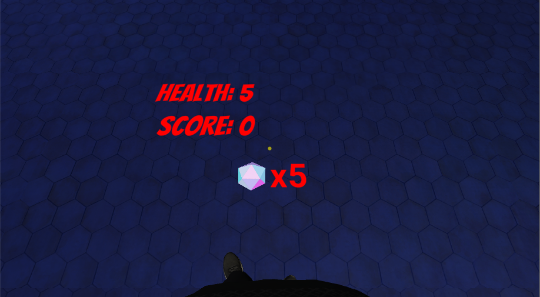
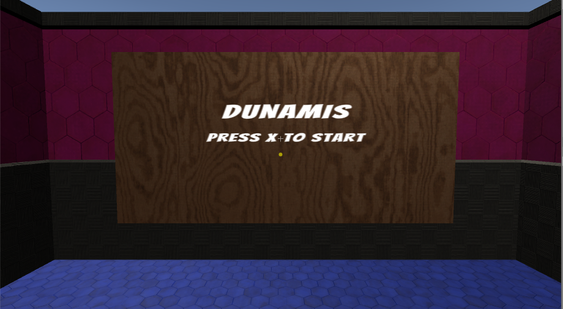

# Heads Up Display (HUD)

## Score, Health, Ammo
There is a canvas at the player's feet that displays the crucial game information. It contains the player's score, health and ammunition. The text for these are updated by the [Score Manager class](https://cseegit.essex.ac.uk/ce301_2020/ce301_craig_jamal/-/blob/master/Unity%20CE301/Capstone%20Project/Assets/Scripts/ScoreManager.cs). This canvas is positioned in a way where it doesn’t clutter the player’s view, but they can still easily look down to see it when necessary. I also implemented the HUD like this because from the research I did, I found out that it is taboo to have a conventional HUD that is an overlay to the viewport because it can break immersion and cause sickness.   
   

A 2D sprite has been used display a Dunamis gem icon. I created the sprite by screenshotting the [model](https://cseegit.essex.ac.uk/ce301_2020/ce301_craig_jamal/-/blob/master/Unity%20CE301/Capstone%20Project/Assets/Models/Dunamis%20v2.fbx) from an orthographic view in Blender. Then I used photoshop to make the background transparent.   
   

## Main Menu
I used a world space canvas to contain the main menu text. It displays the title of the game, as well as how to start the game. The canvas is static, mounted on the wall in 3D space. This is more pleasant to navigate than using a conventional 2D menu screen. The player can still look around in the scene, but the canvas will not move with the camera, keeping the player fully immersed.
   

 
## Billboard
This [script](https://cseegit.essex.ac.uk/ce301_2020/ce301_craig_jamal/-/blob/master/Unity%20CE301/Capstone%20Project/Assets/Scripts/Billboard.cs) is used to make objects face directly at the camera at all times. This script has been added to some of the 2D sprites in the game, like the waypoint markers and crosshairs. 

## Crosshairs
There are two crosshairs that the player can see in the HUD. 

**Yellow Crosshair**   
   
The yellow crosshair is a circular sprite that shows the exact centre of the direction the player is facing. The player can use this crosshair to accurately aim their head, which is necessary for picking up Dunamis gems and throwing them at enemies.   
The yellow crosshair uses a [script](https://cseegit.essex.ac.uk/ce301_2020/ce301_craig_jamal/-/blob/master/Unity%20CE301/Capstone%20Project/Assets/Scripts/Crosshair.cs) that keeps the crosshair at a precise offset away from the camera at all times. The sprite used is the Knob sprite provided by Unity, but I changed the filter of the sprite renderer to be yellow and transparent.

**White Crosshair**   
   
The white crosshair is a sprite of a cross. This is used to show which direction is forward, relative to the player’s body. It uses the billboard script to make sure that the player can always see it face on.
I created the sprite using Inkscape and Photoshop.   

Here’s the crosshair in black, just so that it can be seen on this white page.   
   

## Waypoint Marker
When the player uses their ability to find a path to the nearest gem spawner, waypoint markers placed in the air to display the path to the player.   

   
I created this waypoint marker image using Inkscape and Photoshop.   

There are two scripts that are applied to waypoint markers.   

The first is the [Waypoint Marker](https://cseegit.essex.ac.uk/ce301_2020/ce301_craig_jamal/-/blob/master/Unity%20CE301/Capstone%20Project/Assets/Scripts/WaypointMarker.cs) script, which determines whether a waypoint marker is visible. If the distance between the marker and the target of the path is less than the distance between the player and the target of the path, the marker will be visible. However, if the marker is further away from the target than the player is, the marker will disappear. This is so that when the player walks past the markers to get to the target of the path, they will only see the markers in the direction that lead to the target. This declutters the level and stops the player from getting confused with which direction of the path leads to the target.   

The second is the [Billboard](https://cseegit.essex.ac.uk/ce301_2020/ce301_craig_jamal/-/blob/master/Unity%20CE301/Capstone%20Project/Assets/Scripts/Billboard.cs) script, which is used to rotate the waypoint markers so that they always face the player no matter what direction the player looks in.  

[Return to Master Repository](https://cseegit.essex.ac.uk/ce301_2020/ce301_craig_jamal/-/tree/master)
