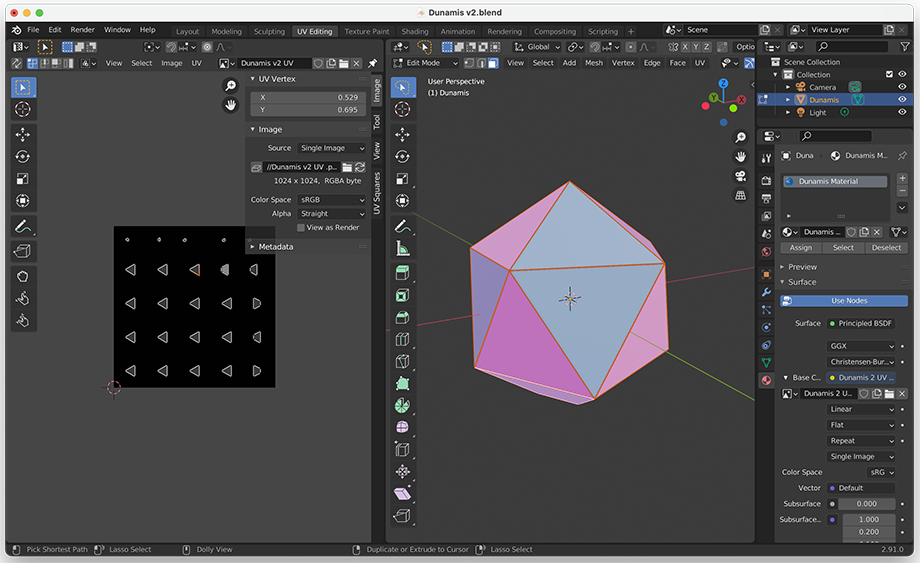
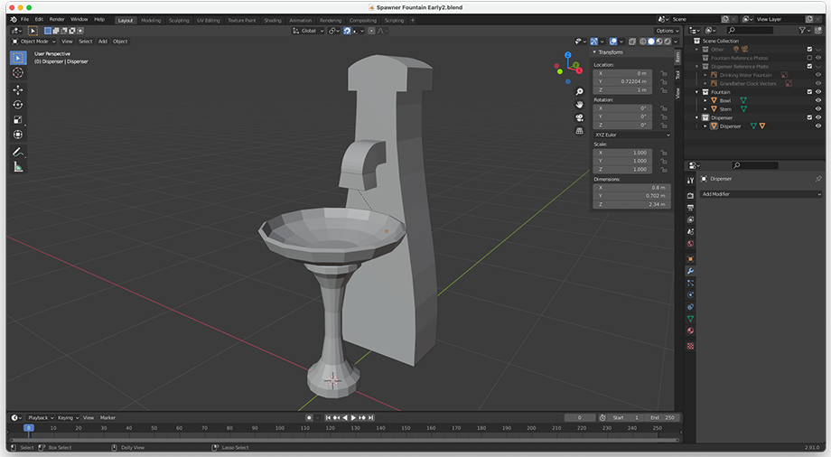
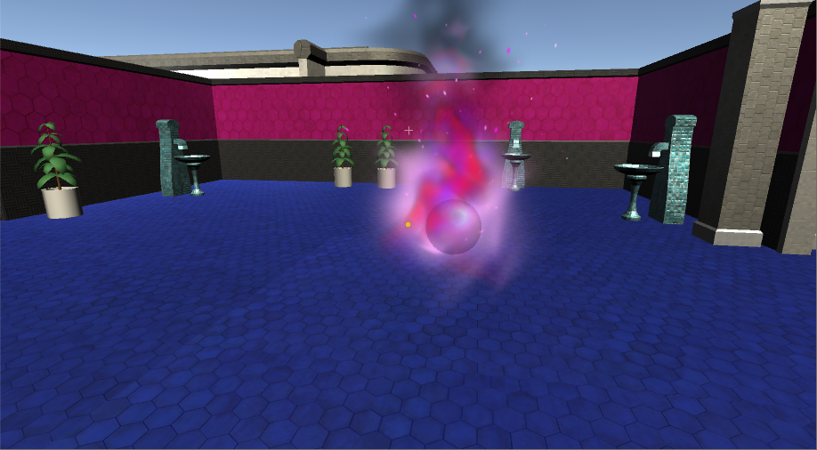
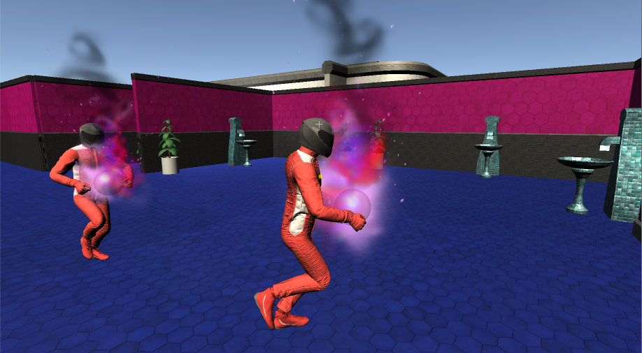

# Interactable Objects

## Dunamis Gems
   
These are what the game revolves around. The player earns points by collecting Dunamis gems that are scattered around the map. The player earns points by collecting Dunamis gems that are scattered around the map. They are spawned in by gem spawners, so the player must travel to gem spawners in order to find and collect them. They are also spawned at piped dispenser stations.   

There are two types of Dunamis gems. 
The purple-blue Dunamis gems are the most common type. When the player has collected this type of Dunamis gem, it is added to their ammunition stock. Players can throw these Dunamis gems at enemies in order to defend themselves. If a thrown Dunamis gem hits an enemy, the enemy will die, and the Dunamis gem will disappear. If a thrown Dunamis gem does not hit an enemy, it will ricochet off of any objects hit, and will disappear after a few seconds. A short [script](https://cseegit.essex.ac.uk/ce301_2020/ce301_craig_jamal/-/blob/master/Unity%20CE301/Capstone%20Project/Assets/Scripts/RockCube.cs) has been applied to Dunamis gems in order to implement this functionality.  

The green Dunamis gems are only spawned at piped gem dispensers. When these Dunamis gems are collected, they are not added to the player’s ammunition stock, but they reward the player with more points than the purple-blue Dunamis gems.   

**Model in Blender**   
   
I created the model of the Dunamis gems using Blender. I originally applied texture directly to the model inside blender, but it didn’t carry over to Unity, so I had to create my own texture using and export of the UV map of the model. I created the texture in Photoshop.   

**Purple-Blue Dunamis Gem Texture**   
   

**Green Dunamis Gem Texture**   
  

## Dunamis Gem Spawners
   
These are what the Dunamis gems spawn in from. There are many gem spawners that have been scattered around the map. The [Spawners Manager script](https://cseegit.essex.ac.uk/ce301_2020/ce301_craig_jamal/-/blob/master/Unity%20CE301/Capstone%20Project/Assets/Scripts/SpawnersManager.cs) takes care of spawning in Dunamis gems at random gem spawners. In order to spawn the Dunamis gems, the Spawners Manager script calls a method in the [Gem Spawner script](https://cseegit.essex.ac.uk/ce301_2020/ce301_craig_jamal/-/blob/master/Unity%20CE301/Capstone%20Project/Assets/Scripts/RockSpawner.cs). When a Dunamis gem is spawned in, it is stored in the bowl of the gem spawner. A maximum of 6 Dunamis gems can be contained at once, so if the bowl reaches its max capacity, Dunamis gems will no longer be spawned at the spawner. The player can press L1 on the PS4 controller to display the path to the nearest gem spawner that contains a Dunamis gem. The player can collect the Dunamis gems contained in the bowl of the gem spawner by looking at the Dunamis gem and pressing R1 on the PS4 Controller. 

**Model in Blender**
   
I created the model of the gem spawner using Blender. Using the [Small Mosaic Tiles texture](https://cseegit.essex.ac.uk/ce301_2020/ce301_craig_jamal/-/tree/master/Unity%20CE301/Capstone%20Project/Assets/Models/Textures#small-mosaic-tiles), I created material in Unity that I applied to the model. I experimented with applying different materials to this model, but I felt like this one was the best.   

## Piped Gem Dispenser Stations

These are where both types of Dunamis gems can be spawned from. From here, gems are spawned at a constant rate, irrespective of how many other piped gem dispenser stations there are in the level. From the right pipe, purple-blue-white Dunamis gems are spawned. From the left pipe, green Dunamis gems are spawned. In order to collect the gems being spawned, the player must slide a tray and place it underneath the pipe that they want to collect gems from. Then they must slide it back to the centre, so that they can collect the gems that fell into the bowl of the tray. This mechanic was designed to take advantage of the VR environment in a way where the player the player has to use head movement in order to perform the task. This was an attempt to increase the immersion the player feels when playing the game.   

In order to collect the gems spawned, the player must look directly at the one of the tray’s handles, and then grab hold of it by holding R1 on the PS4 Controller. While holding the tray, the player must rotate their head to look at the pipe they want to slide the tray to. Once the tray is in position, the player can let go of the tray, and must wait for the Dunamis gems to fall into the bowl of the tray. Once a satisfactory amount has fallen into the bowl, the player must slide the tray back to the centre, so that they can collect the gems in the bowl without the glass blocking access to them.   

I created the model for piped gem dispenser stations using Unity’s ProBuilder package. I applied materials to the model by using various textures that I had downloaded from [textures.com](https://www.textures.com/library).   

## Health Orbs
   
   
Health Orbs represent the health that enemies steal from the player after successfully hitting the player. When an enemy hits the player, the player’s health is stolen and a health orb is spawned into the enemy’s hand. The enemy will carry the health orb while traveling to an exit. If the enemy arrives at an exit, the enemy, along with the health orb, will despawn. If the player kills an enemy who is carrying a health orb, the health orb will be dropped and will hover in the air at the position it was dropped. The player can then collect and replenish their stolen health by walking into the hovering health orb. The functionality of the health orb has been implemented using a short [script](https://cseegit.essex.ac.uk/ce301_2020/ce301_craig_jamal/-/blob/master/Unity%20CE301/Capstone%20Project/Assets/Scripts/HealthOrb.cs).    

The model for the health orb is simply a sphere created in Unity. The health orb contains a particle system that I imported from the [Unity Asset Store](https://assetstore.unity.com/packages/vfx/particles/fire-explosions/procedural-fire-141496). I modified the colours of the particle system to make it look more appropriate.   

[Return to Master Repository](https://cseegit.essex.ac.uk/ce301_2020/ce301_craig_jamal/-/tree/master)