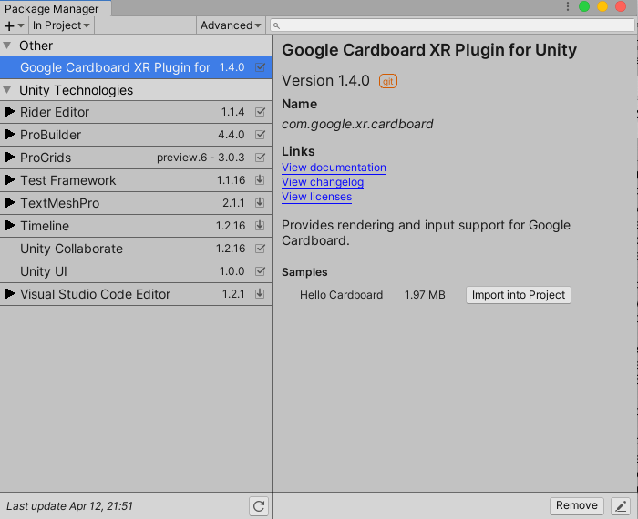
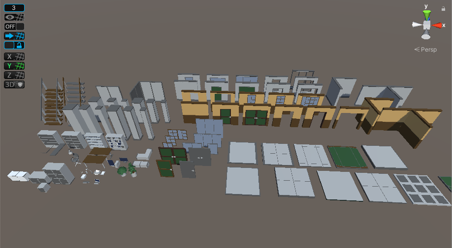
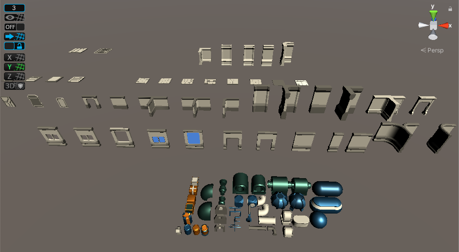
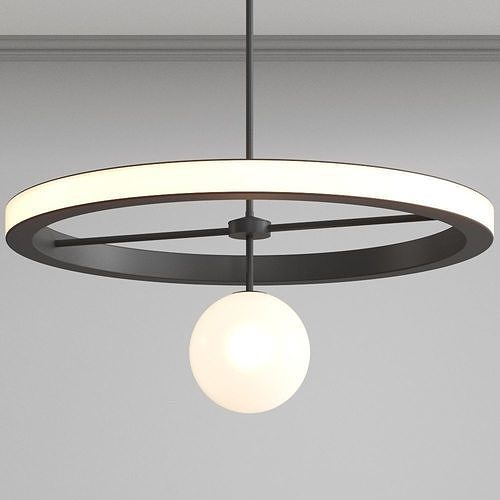
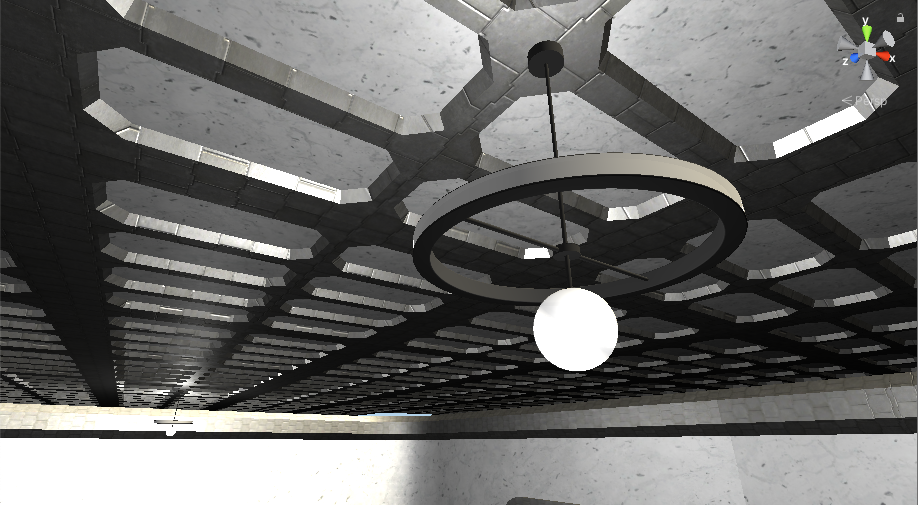
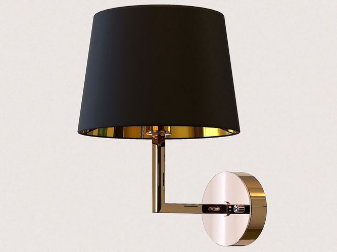
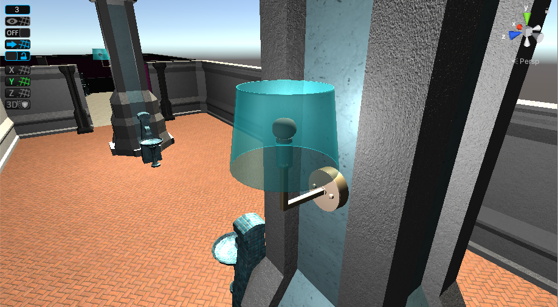

# Packages and External Assets
   
I imported a few packages to the project.   

## [Google Carboard XR Plugin for Unity](https://developers.google.com/cardboard/develop/unity/quickstart)
Version 1.4.0   
This is the package that allows the game to be played in VR. This was simply achieved by converting the main camera into a XR Rig. I placed the XR Rig at the position of where the head for the player’s model is. I changed the clipping plane of the camera, so that the head would not be visible in viewport, despite it intersecting with the head.   

## [ProGrids](https://docs.unity3d.com/Packages/com.unity.progrids@3.0/manual/index.html)
Version 3.0.3   
This is a package I imported that allows game object positions to be placed and snapped to a grid. This was an extremely useful tool that helped to place objects exactly adjacent to each other, which was necessary for placing geometry objects like floor tiles and walls. It complemented the use of [Snaps Prototype Assets](#snaps-prototype-packs) because they were designed as scaled in conjunction of ProGrids, so that they could easily be snapped to the grid.  

## [ProBuilder](https://unity3d.com/unity/features/worldbuilding/probuilder)
Version 4.4.0  
This is a package that allows construction and editing of geometry in Unity. I haven’t really used this feature, but the package is a prerequisite for Snaps Prototype Packs, which were created using ProBuilder.   

## [Snaps Prototype Packs](https://cseegit.essex.ac.uk/ce301_2020/ce301_craig_jamal/-/tree/master/Unity%20CE301/Capstone%20Project/Assets/AssetStoreOriginals/_SNAPS_PrototypingAssets)    
**[Snaps Prototype Office](https://assetstore.unity.com/packages/3d/environments/snaps-prototype-office-137490)**   
   

**[Snaps Prototype Sci-Fi](https://assetstore.unity.com/packages/3d/environments/sci-fi/snaps-prototype-sci-fi-industrial-136759)**   
   
I imported two of Snaps Prototype Asset Packs into my project. They contain prefabs of geometry and props like walls, floors, pillars, tables etc. The majority of the geometry used in my game are from these two asset packs. In order to suit and customise the aesthetic of my game, I changed the materials that were originally applied to the assets I used from these packs. Using these modified assets, I created my own prefabs, which I placed in the game scenes.   

## Ring Lamp
   
I downloaded this model of a lamp from [cgtrader.com](https://www.cgtrader.com/items/2651725/download-page). Inside of Unity, I modified the textures that were applied to it. I added a point light where the bulb is and created a prefab of the modified lamp. I used it as a ceiling lamp in the level.   
   

## Crystal Lux Conte AP1 Chandelier
  
I downloaded this model of a lamp from [cgtrader.com](https://www.cgtrader.com/items/814627/download-page). Inside of Unity, I modified the textures that were applied to it. I added a point light where the bulb is and created a prefab of the modified lamp. I used it as a side lamp in the level.  
   

[Return to Master Repository](https://cseegit.essex.ac.uk/ce301_2020/ce301_craig_jamal/-/tree/master)