# A* Search Testing - Enemy to Player

The A* Search initially took about 30ms-40ms to generate a path from the Racer to the player, when the grid size was 100x100. I was confused why this was the case, because the debug logs were saying that the A* search calculation only took 0.1ms-0.2ms. I used Unity's Profiler to get a better picture of what was going on. I noticed that the Get methods I was using in my code took a relatively long time to process. Taking this into account, I decided to refactor the Get methods, which resulted in the A* Search path generation being reduced time down to 9ms-12ms. I recorded 5 results: 9ms, 13ms, 12ms, 9ms, 10ms.  

**Two Results I Recorded from the Profiler**   
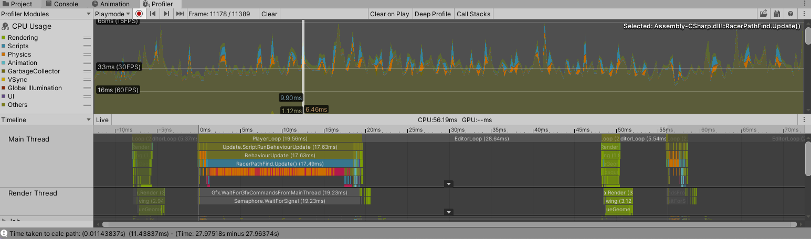   
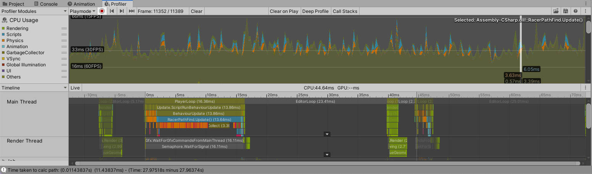   

**The Results Output to the Console**   
   

After further analysis of the data being recorded in the Profiler while the game was playing, I realised that the main reason why the path for the Racer was taking so long to be generated because of the repeated recreation of the grid that it used to run the A* Search.  

**The Profiler revealing the grid creation taking 31.68ms alone to run**   
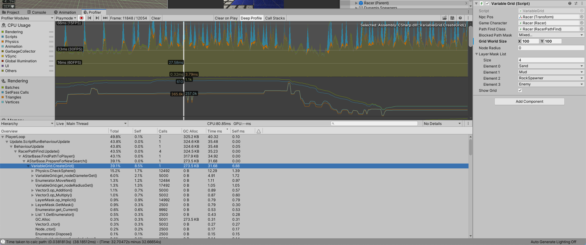   

Taking this into account, I refactored my code so that a new grid would not be created every time a path is to be generated. Now a grid is created for each [game character](/Technical%20Documentation/Game%20Characters/README.md#game-characters) that uses the A* Search, and the only the nodes that represent where the game character has moved to gets updated. This refactor of code resulted in the generation of paths being decreased drastically. The path generation went from about 9ms-12ms to about 1.2ms-1.5ms. I recorded 5 results: 1.5ms, 1.4ms, 1.3ms 1.3ms 1.2ms 1.5ms.   

**The prints to the console showing the reduced total path generation times. It also shows how the actual A\* Search took only took 0.3ms-0.4ms to run**   
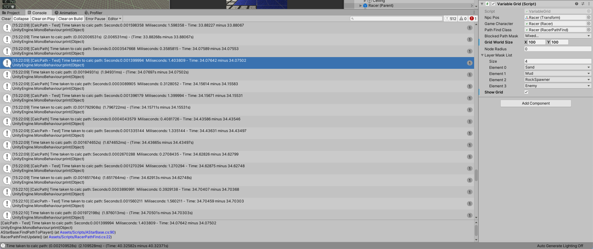   

**The Profiler showing the path generation taking 1.8ms**   
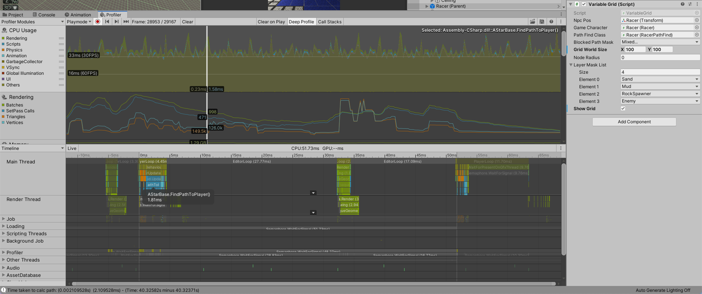   

### Testing larger grid sizes
After drastically reducing the time it takes for a path to be generated, I did more testing to see how the path generation would perform for grids of larger sizes. 
I found that no matter the size of the grid, the full path generation usually takes 0-3ms, with a spike that can go up to 6ms, which is probably when a path cannot be found.  

**200x200 Grid path generation results were usually between 0-3ms**   
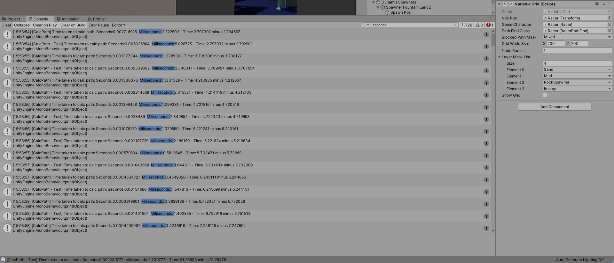   

**1000x1000 Grid path generation results were usually between 0-3ms**   
   

While testing path generation times for different sized grids, I realised that showing the grid in the Unity Editor using Gizmos was very intensive to render and caused the frame rate of the game to decrease substantially. So, I started testing the path generation times without the grid being displayed.

**100x100 Grid displayed - Resulted in very low FPS**   
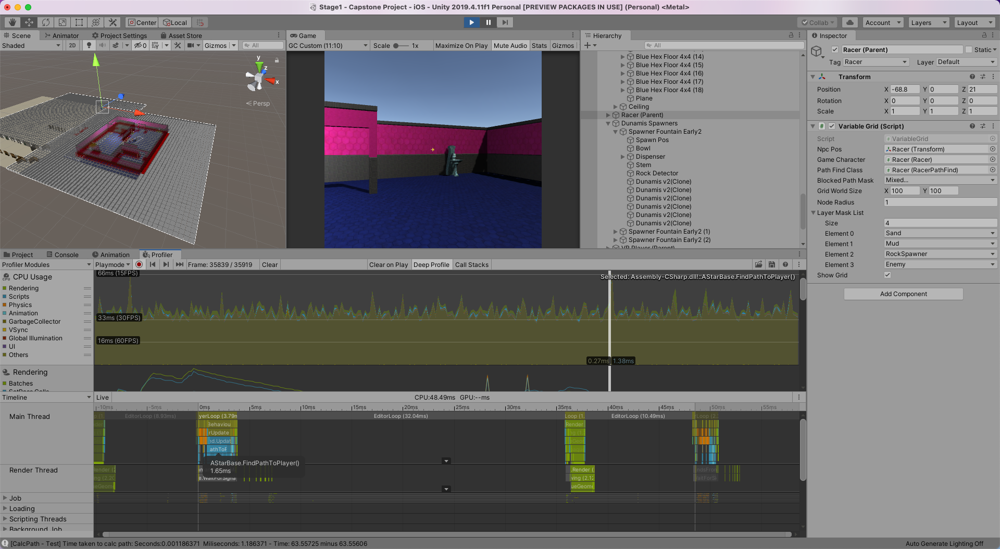   

**100x100 Grid not displayed - Resulted in increased FPS**   
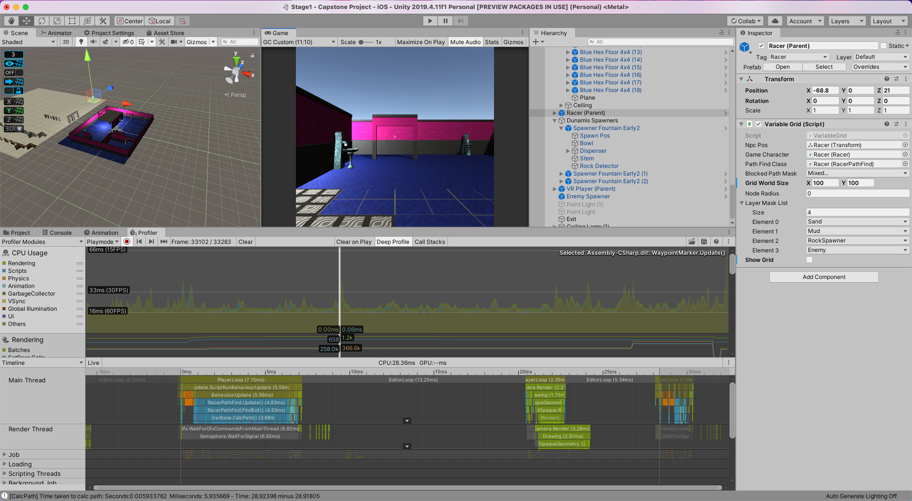  

**200x200 Grid displayed - Resulted in extremely low FPS**  
The FPS was so low that it was scary to run the game due to how hard intensive it was for my laptop to run the game.   
I didn't bother the testing the path generation times for larger grids with the grid displayed because it wouldn't have been playable and could potentially ruin my laptop hardware.   
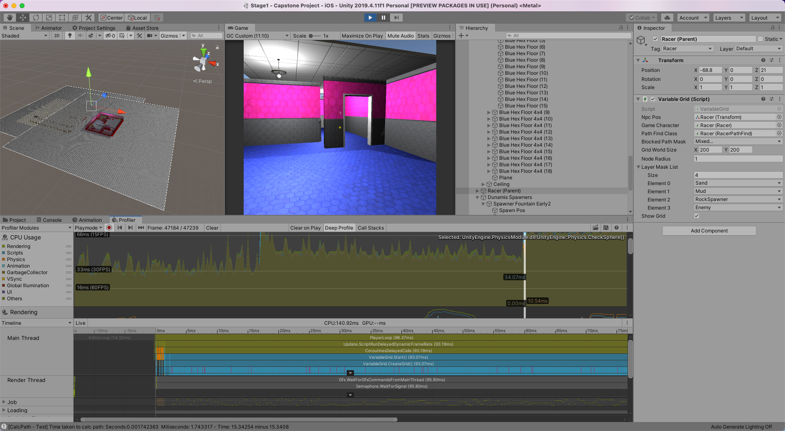   

**200x200 Grid not displayed - Resulted in increased FPS** 
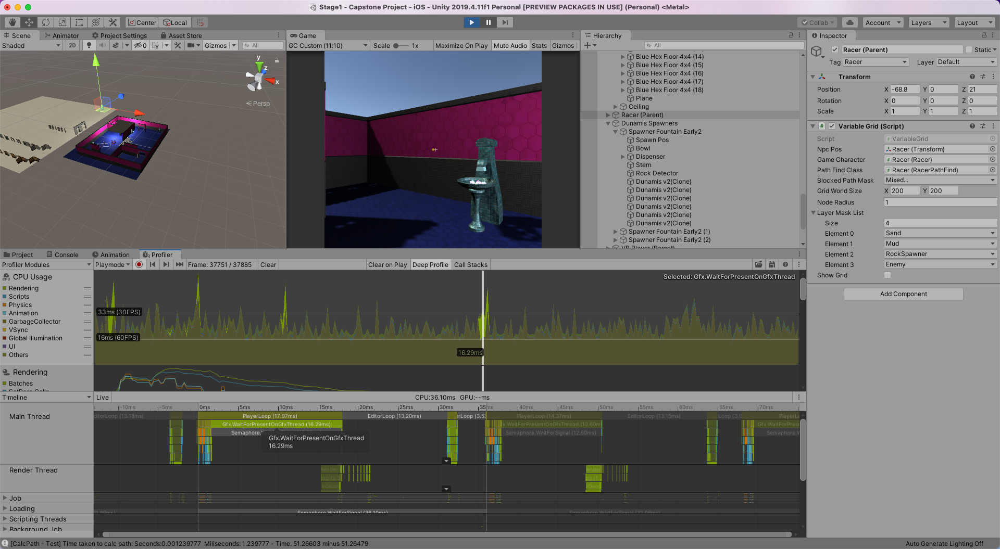  

While testing, I investigated the different lengths of time it took for the grid to be created. As found before, it takes a very long time to create the grids, especially the larger the grid becomes. This was a problem, because every time a game character was spawned, it had to create its grid, which immediately caused frames to drop while processing this. 

100x100 grid creation spike is 25ms, 24ms, 24ms, 25ms, 24ms  
200x200 grid creation spike is 92ms, 94ms, 95ms, 93ms, 96ms - This spike time is still quick enough to not be noticed by the player.   
500x500 grid creation spike is 559ms, 560ms, 559ms, 557ms, 557ms   
1000x1000 grid creation spike is 2400ms, 2433ms, 2794ms, 2304ms, 2287ms   

The time it took to create a grid was not affected by whether the grid was displayed in the Unity Editor or not.   

**100x100 Grid creation taking 25ms to process with grid hidden**   
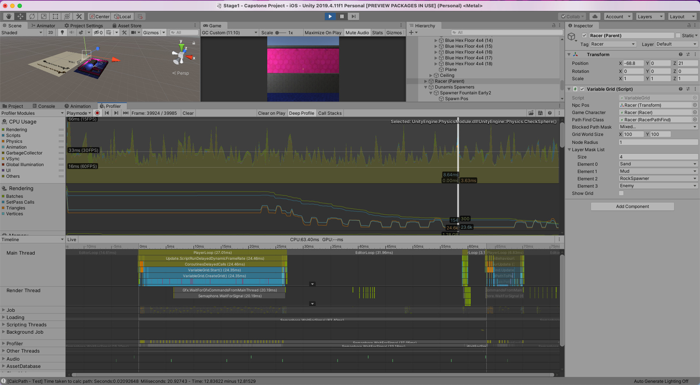   

**100x100 Grid creation taking 25ms with grid displayed**  
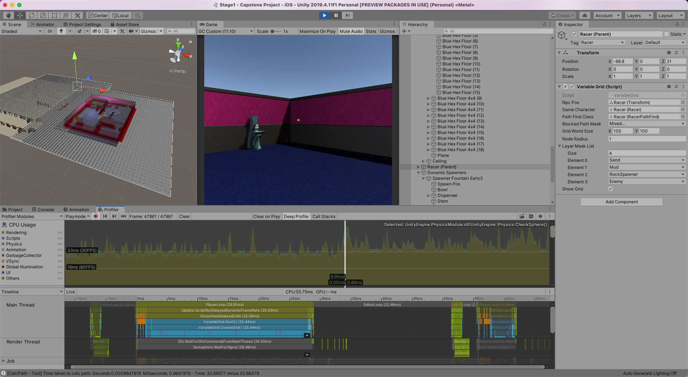   

**200x200 Grid creation taking 96ms to process**   
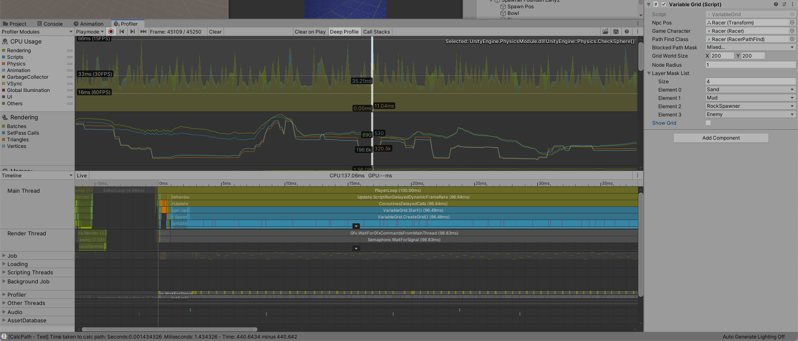   

**500x500 Grid creation taking a 559.76ms spike to process**  
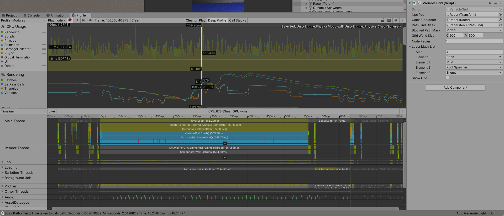   

**1000x1000 Grid creation taking a 2415ms spike to process**  
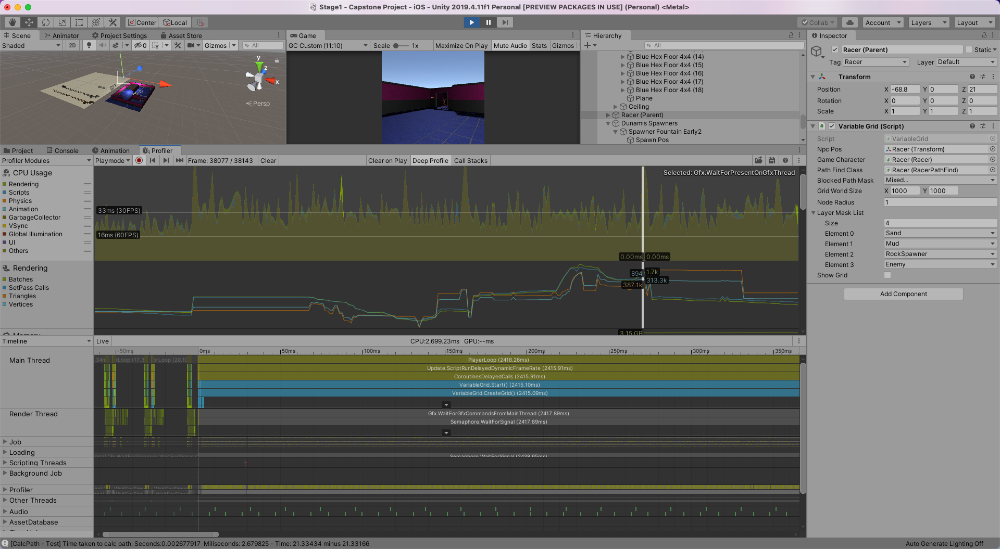  

In order to deal with the long spikes that occurred when a grid was created, I refactored my code so that the grid is only created once, which is when the scene loads. Now, all instances of a class that uses a grid will copy this original grid for their class, instead of generating it again themselves. Then when there is a change in the grid, only the nodes for the dynamic game objects are updated, instead of regenerating the whole grid to display this. This had such great results that the game could now be played without frames dropping when a game character is instantiated for even a 1000x1000 grid.   

**1000x1000 Grid after change. Now the rendering is what takes the longest to process**   
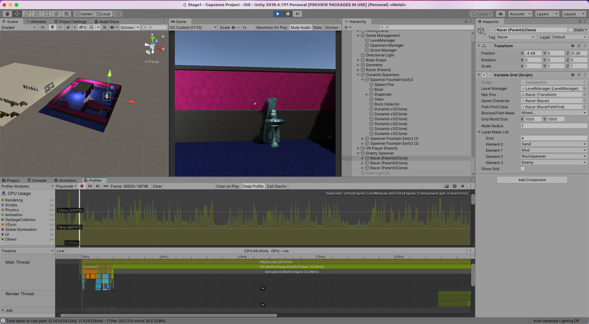   

**1000x1000 Grid after change. Grid creation time has reduced from 2200ms+ to 20ms**   
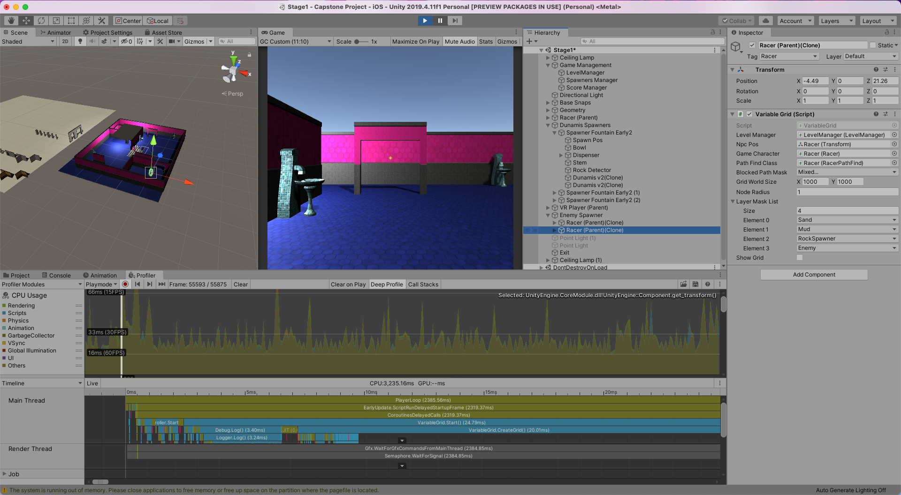   

### Conclusion
After all this testing, I concluded that a 100x100 grid was the most appropriate size for the level to be created to fit. My code had been efficiently refactored to the point where the size of the grid didn't really matter, so I could choose any size. I decided to use a 100x100 grid size because I can create enough geometry to fill it in the time that I have.  

[Return to Main Repository](https://github.com/jamalcraig/Dunamis)