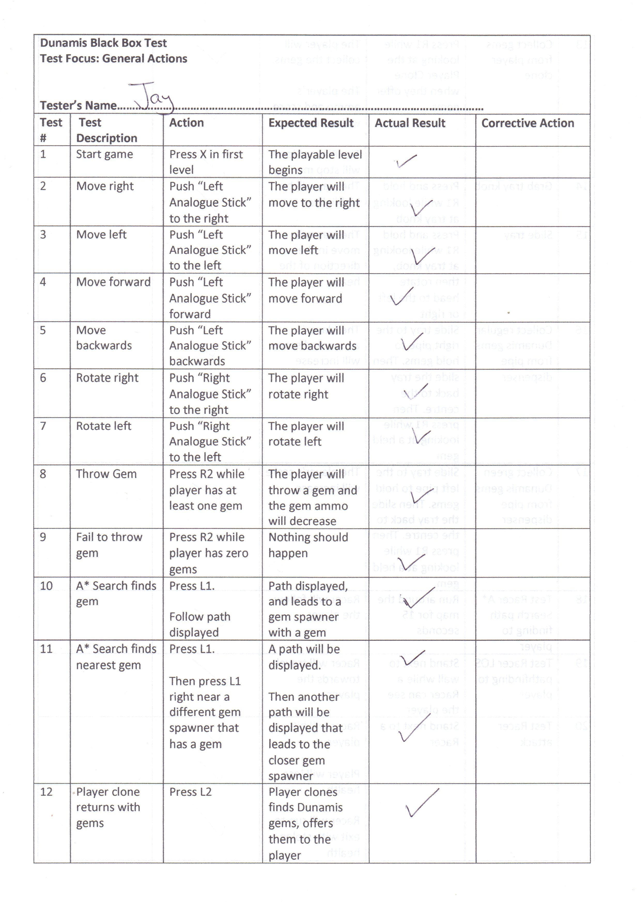

# Black Box Testing

Unfortunately, due to the COVID-19 pandemic, only three participants were able to test the game. They were sequentially instructed to follow certain commands that were given to them. The results of the command that they attempted to follow was recorded in a table.  All but one command in the test passed and functioned the way that they were intended. The command that didn't fully function as intended was the calling of the Player Clone to return with gems. The clone was not able to find a path to the player if the player was standing too close to and obstacle. This can somewhat be corrected by adding Line of Sight pathfinding to compensate in such a scenario. However, another issue that was discovered was that due to previous development testing, only one Racer exit was currently active in the game, so the Racers always went to that exit, since it was the only exit it could find.  

The qualitative feedback of the game was very positive. The participants were exceedingly impressed with the quality of the game.  

## Results 

**Derrick's Test Results**  
 
 
   

**Derrick Playing the Game**
  

**Jay's Test Results**  
  
  
  

**Jay Playing the Game**
  

**Brandon's Test Results**
  
  
  

[Return to Main Repository](https://github.com/jamalcraig/Dunamis)